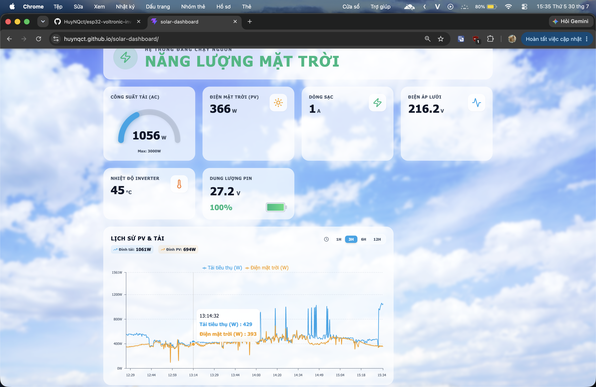
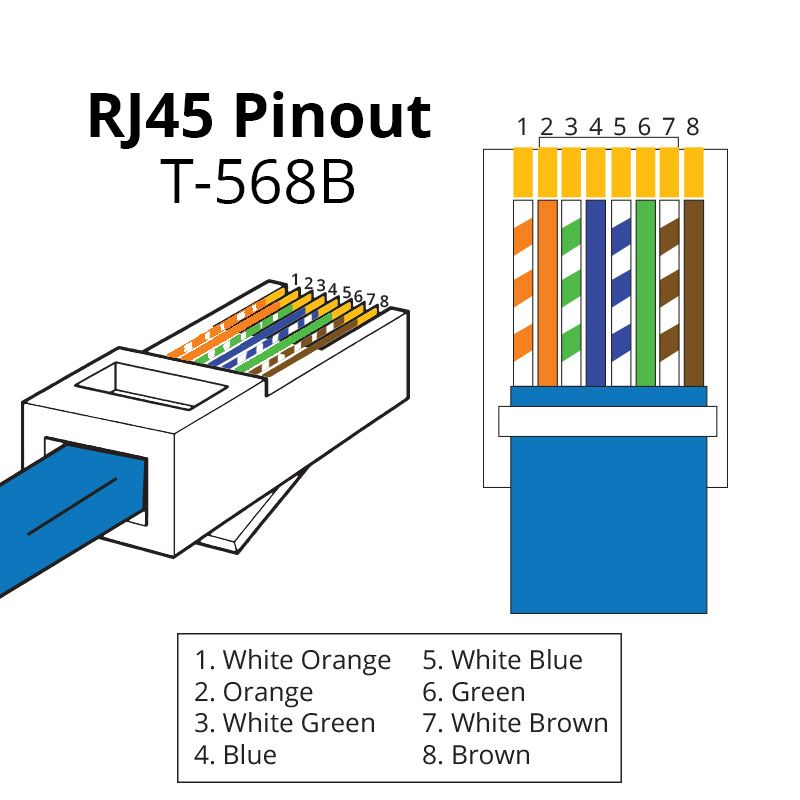
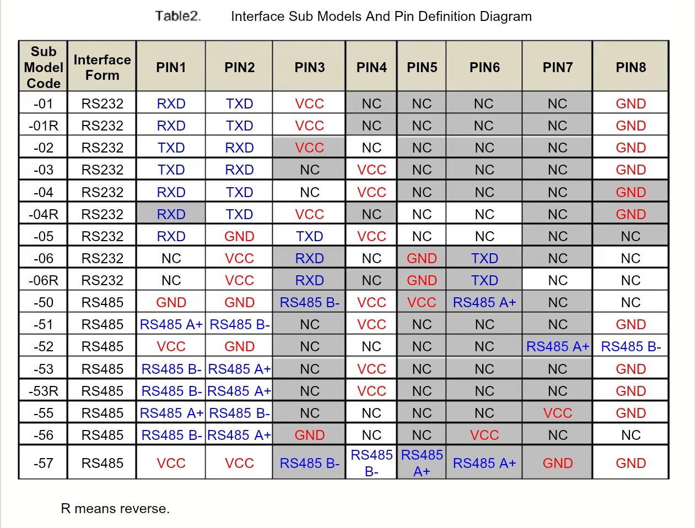
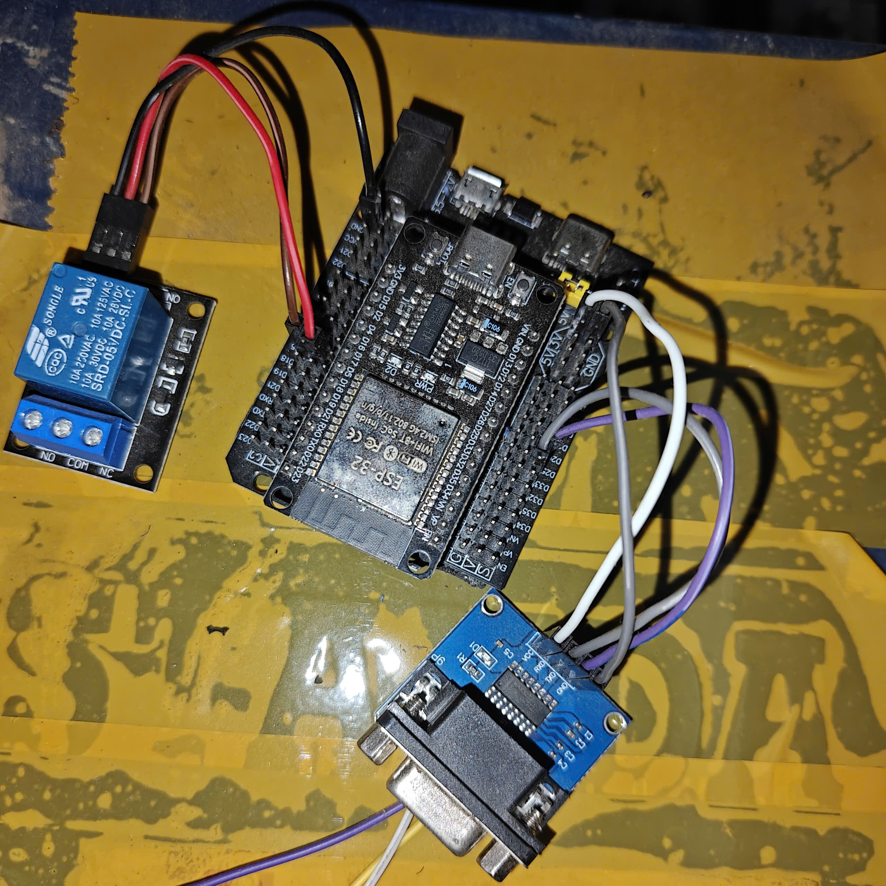
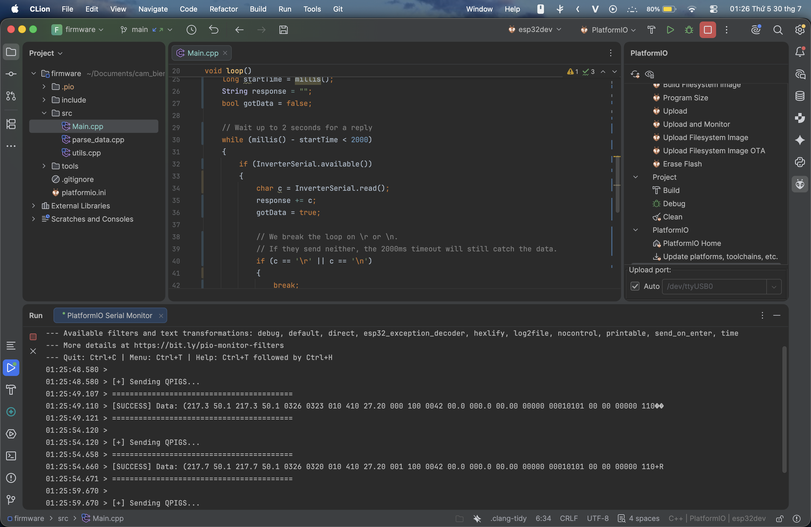
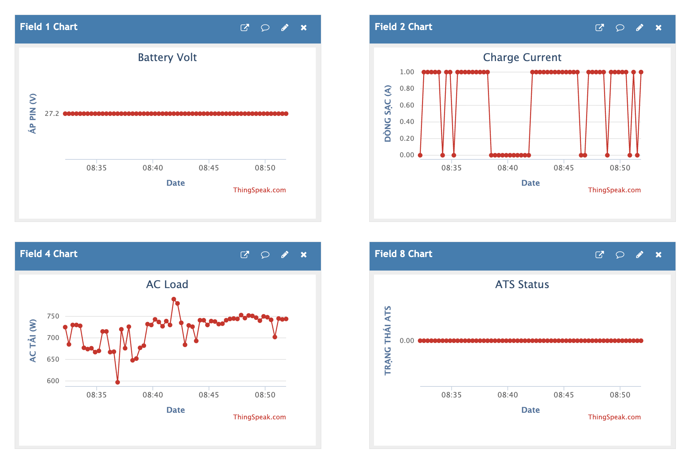
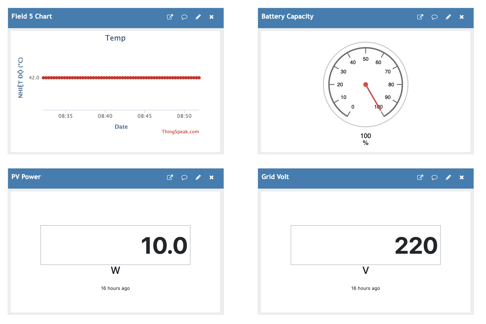

# ⚡ ESP32 Universal Hybrid Solar Inverter Dashboard & ATS


> ⚠️ **DISCLAIMER: PROCEED AT YOUR OWN RISK.**  
> This is a personal DIY project built for my own solar setup. You are dealing with inverters that handle **high voltage mains (220V AC)** and high-current DC battery banks. A wrong connection can fry your microcontroller, your inverter's comm board, or cause a fire. **DO NOT attempt this if you lack basic knowledge of electronics, multimeters, and serial communication.** I take zero responsibility for blown equipment.

---

## Table of Contents

- [1. The Backstory](#-1-the-backstory)
- [2. Features](#-2-features)
- [3. How It Works](#-3-how-it-works)
- [4. Bill of Materials](#-4-bill-of-materials)
- [5. Hardware Wiring](#-5-hardware-wiring-the-hardest-part)
- [6. Cloud Setup](#-6-cloud-setup)
- [7. Firmware Installation](#-7-firmware-installation)
- [8. Frontend Setup](#-8-frontend-setup)
- [9. Under the Hood](#-9-under-the-hood)
- [10. Acknowledgements](#-10-acknowledgements)
  
---

## 1. The Backstory 
It all started when I set up my hybrid solar system. The inverter works like a charm, but the official Wi-Fi monitoring dongle (the infamous Solar Plug-RWB1 and its siblings) is an absolute joke. It's an overpriced piece of plastic glued to a laggy, closed-source cloud app that updates whenever it feels like it. 

I refused to pay the "OEM tax" just to see my own battery voltage. I wanted real-time data, an Auto Transfer Switch (ATS) logic that actually makes sense, and I wanted it fully under my control. 

After digging into how these inverters communicate, I found out that 99% of these budget-friendly Chinese hybrid inverters (Techfine, SUOER, EVO, Sumry,...) share the same DNA: they are **Voltronic clones**. 

They use a simple ASCII protocol. Once you send the command `QPIGS` (plus a 2-byte CRC) at its serial port, the inverter immediately vomits out a massive string of data containing grid voltage, PV power, battery capacity, and temperatures. No API keys, no handshakes. Just raw ASCII.

---

## 2. Features



- **Real-time Monitoring:** Bypasses OEM clouds. Data goes straight from your inverter to your own dashboard.
- **Serverless Frontend:** React dashboard that pulls data directly from ThingSpeak. Zero backend.
- **Smart ATS Logic(Optional):** Auto-switches to Grid power under heavy loads (Fail-safe mechanism).
- **OTA Updates(Optional):** Flash new C++ firmware to your ESP32 wirelessly.

---

## 3. How It Works
1. **Edge Node:** ESP32 asks the Inverter for data via RS232.
2. **Data Pipe:** ESP32 pushes parsed data to **ThingSpeak** (Free IoT Platform).
3. **Frontend:** React SPA fetches data from ThingSpeak and visualizes it. 

---

## 4. Bill of Materials
- 1x **ESP32 Development Board**
  > This project **requires a dual-core ESP32** (like the **ESP32-WROOM-32 DevKit**, Type-C + CH340C version is highly recommended).
  > 
  > Don't the ESP32-S2, ESP32-C3, or the ancient ESP8266.
  > 
  > Why? Because the firmware relies heavily on FreeRTOS task pinning. Network-heavy tasks (Wi-Fi, OTA, Telegram, ThingSpeak) are pinned to **Core 0**, while **Core 1** is dedicated to real-time inverter polling and ATS control.
  > 
  > A single-core MCU will choke, crash, and is **not supported**.

- 1x **MAX3232 RS232 to TTL Module** (Required)
  > This module converts RS232 voltage levels into 3.3V TTL. Without it, the ESP32 UART may be permanently damaged.

- 1x **5V Relay Module** (Optional, for ATS).
  > Required only if you want to enable the **ATS** feature.
  > 
  > The ATS automatically transfers selected high-power loads to the utility grid whenever the inverter approaches its power limit.
  > 
  > Once the inverter load drops back within the available solar capacity, those loads are automatically switched back to the inverter.
  
  This allows the system to:
    - Prevent inverter overload.
    - Maximize solar energy utilization while maintaining uninterrupted operation.

- 1x **Ethernet Cable (Cat5/Cat6).**
  
  Used only to harvest the RJ45 connector. No Ethernet communication is involved.
  
- **Multimeter.**

  You'll need it to verify the inverter pinout, check continuity, measure voltages and avoid releasing the magic smoke before the first boot.

---

## 5. Hardware Wiring (The Hardest Part)

*I learned this the hard way. I literally fried two MAX3232 chips back-to-back because I blindly trusted a schematic I found on a Chinese forum.* 

*Different OEM manufacturers often use different RJ45 pin assignments, even for very similar inverter models.* 

***Verify everything.***

## Known limitations

- Only tested on ESP32-WROOM.
- ATS logic is designed around my own installation.
- Some inverter models still need verification.

### The RJ45 Pinout Hell (Check your inverter brand)
*(I originally intended to support only Techfine inverters.)*

*(After testing a few other models and reading service manuals from different OEMs, I found that most Voltronic-based units expose almost the same protocol. That's why this project now works with more brands than I originally expected.)*

**PRO-TIP: Read The Manual first!**

Before you start cutting wires and guessing, dig up your inverter's user manual. Some rare, benevolent manufacturers actually print the exact RS232 RJ45 pinout diagram in the appendix or installation section. If you find it, you're golden. If not, welcome to hell.

Cut your Ethernet cable, strip the wires, and prepare to trace the pins. 

> **The Ethernet Color Sheet (Standard T568B):**
> If you are sacrificing a standard network cable, here is the official color mapping from Pin 1 to Pin 8 so you don't have to guess:

| Pin | Color |
|-----|--------------|
| 1 | White-Orange |
| 2 | Orange |
| 3 | White-Green |
| 4 | Blue |
| 5 | White-Blue |
| 6 | Green |
| 7 | White-Brown |
| 8 | Brown |



*(Source: https://www.showmecables.com/).*

Based on deep community research, here is the reference table to match your inverter with the right pinout:



*(Source: Publicly shared service documents).*

#### 🔴 Scenario A: Type NO -04 (The SUOER / EVO standard)
**Pinout:** `Pin 1 (RXD)` | `Pin 2 (TXD)` | `Pin 4 (VCC)` | `Pin 8 (GND)`

**Supported Brands & Models:**
- **SUOER:** Most hybrid models (1.6kW - 10kW).
- **EVO:** EVO-4200, EVD-6200, EVO-10200
- **SUMRY** Eco Plus 4.2k, Eco Plus 6.2k, Victor Max 10.2k, SP-3200, SP-4200, SP-7000
- **Anern:** AN-SCI-EVO series (4200/6200/10200) and FGI series.
- **PowMr:** Some ECO/MAX series, HVM, LVM.

#### 🔵 Scenario B: Type NO -06 / -06R (The Voltronic / Techfine standard)
**Pinout:** `Pin 2 (VCC)` | `Pin 3 (RXD)` | `Pin 5 (GND)` | `Pin 6 (TXD)`

**Supported Brands & Models:**
- **Techfine:** Most hybrid models (Confirmed working perfectly here).
- **Voltronic / Axpert Clones:** PIP, VM, MKS series (The most popular standard).
- **Easun:** SM II, SMR II, Isolar series.
- **PowMr:** Variants using Voltronic boards.

*(Note: If you own a PowMr or SUMRY, you might have to check your manual, as they use both standards depending on the OEM batch).*

---

### ⚠️ Step 1: The VCC Voltage Check

Before connecting *anything* to your ESP32, plug the stripped RJ45 cable into RS232 port on the powered-on inverter.

Set your multimeter to DC Voltage. Put the black probe on GND and the red probe on the VCC pin. 

- If it reads **~5V**: You can feed this directly to the `VIN` or `5V` pin of your ESP32.
- If it measures **more than 5V (12V)**: **STOP!** You MUST use a buck converter (like LM2596) to step it down to 5V. Feeding 12V to the ESP32 will instantly kill it.

### Step 2: Try The RX/TX Swap

Connect your ESP32 to the MAX3232 module:
`VCC` ➔ `VCC`  |  `GND` ➔ `GND`  |  `GPIO 25` ➔ `RX`  |  `GPIO 26` ➔ `TX`

Now connect the MAX3232 to the Inverter's RX/TX wires based on your Scenario above. 

*(Note: If you send a command and get zero response, **swap the RX and TX wires**. TX must talk to RX, and RX must listen to TX. This solves 90% of communication issues).*



### Step 3: Adjust the Baud Rate

Most Voltronic clones love **2400 baud**. It's slow, but it works. In the code, `InverterSerial.begin(2400)` is the default. 

If your dashboard shows garbage values or nothing happens, your inverter probably runs at `9600` or `19200` or another supported baud rate. Change the baud rate in the C++ firmware until you get clean ASCII text.

### Step 4: Sniffing the Port (Manual Test)

If your dashboard shows absolutely nothing and you are about to throw the ESP32 out the window, **stop**. The issue is usually physical.

Create a new blank project, paste this standalone **Sniffer Code** into `main.cpp`, and flash it. This code does one thing: it screams `QPIGS` at the inverter and listens.

```cpp
#include <Arduino.h>

#define RXD2 25
#define TXD2 26

HardwareSerial InverterSerial(2);

// The QPIGS command + CRC + Carriage Return
const byte qpigs_cmd[] = {0x51, 0x50, 0x49, 0x47, 0x53, 0xB7, 0xA9, 0x0D};

void setup()
{
    Serial.begin(115200); 
    
    // Tweak this baud rate if your inverter is acting deaf
    InverterSerial.begin(2400, SERIAL_8N1, RXD2, TXD2); 
    delay(2000); 
}

void loop()
{
    Serial.println("\n[+] Sending QPIGS...");
    InverterSerial.write(qpigs_cmd, sizeof(qpigs_cmd));

    long startTime = millis();
    String response = "";
    bool gotData = false;

    // Wait up to 2 seconds for a reply
    while (millis() - startTime < 2000)
    {
        if (InverterSerial.available())
        {
            char c = InverterSerial.read();
            response += c;
            gotData = true;

            // We break the loop on \r or \n. 
            // If they send neither, the 2000ms timeout will still catch the data.
            if (c == '\r' || c == '\n')
            {
                break;
            }
        }
    }

    if (gotData)
    {
        Serial.println("=========================================");
        Serial.print("[SUCCESS] Data: ");
        Serial.println(response);
        Serial.println("=========================================");
    }
    else
    {
        Serial.println("[-] No response!");
    }

    delay(5000);
}
```
---
### How to Use the Sniffer for Debugging

Open the **Serial Monitor** at **115200 baud** and watch the output.

---

### 1. The Happy Path

If you see something like:
```text
[SUCCESS] Data: (220.0 50.0 ...)
```


Congratulations! Your wiring is perfect, your baud rate is correct. You can now flash the real firmware.

---

### 2. If There Is No Response

Still seeing:
```text
[-] No response!
```
Don't panic. Power off the inverter, then swap the RX and TX wires between the MAX3232 and the inverter. Flash the sniffer again and test. This is one of the most common causes of communication failure.

---

### 3. Checking the Baud Rate

If swapping wires didn't work, or if you get a string of garbage characters like:
```text
?⸮▒▒▒▒▒▒▒
```
That's usually a sign that the baud rate is incorrect. Open the sniffer source code and locate:
```cpp
InverterSerial.begin(2400, SERIAL_8N1, RXD2, TXD2);
```
Try changing the baud rate to one of the common values:

- 2400 *(default for many Voltronic-based inverters)*
- 4800
- 9600
- 19200
- 115200

Upload the firmware after each change until the inverter responds with clean ASCII text.

---

### 4. Still Nothing?

If you've tried:

- ✓ Both RX/TX combinations
- ✓ Multiple baud rates
- ✓ Verified the RJ45 pinout
- ✓ Confirmed the MAX3232 is powered correctly

…and the inverter is still completely silent, the problem is almost certainly **hardware**, not software.

Double-check:

- RJ45 pin assignment
- GND connection
- RS232 voltage levels
- MAX3232 wiring
- Whether your inverter actually exposes an RS232 port

Five minutes with a multimeter is usually more productive than five hours of changing code.

**If you've done all of that and it's still dead silent, your inverter might just be one of the rare exceptions this guide doesn't cover — sorry, you're on your own here.**

---

## 6. Cloud Setup

We use **ThingSpeak** as our database because paying for an AWS instance just to log battery voltage is for suckers. We also use **Telegram** for real-time alerts so your inverter can scream at you when the grid goes down.

### Setting up ThingSpeak
1. Go to [ThingSpeak](https://thingspeak.com/) and create a free MathWorks account.
2. Click **Channels** -> **My Channels** -> **New Channel**.
3. **Field Ordering:** The ESP32 C++ firmware pushes data in a strict array sequence. You MUST enable and name the fields exactly in this order (unless you want your Battery Voltage to show up as Temperature):
   
   - **Field 1:** Battery Voltage (V)
   - **Field 2:** Charge Current (A)
   - **Field 3:** PV Power (W)
   - **Field 4:** AC Load (W)
   - **Field 5:** Inverter Temp (°C)
   - **Field 6:** Grid Voltage (V)
   - **Field 7:** Battery Capacity (%)
   - **Field 8:** ATS Status (1 = Grid, 0 = Solar)
   - *(Note: If you modify the `main.cpp` payload, adjust these fields accordingly).*
  


     
5. Scroll down and hit **Save Channel**. 
6. Go to the **API Keys** tab. 
   - Copy the **Channel ID** (paste it into `config.h` and the React `.env` file below).
   - Copy the **Write API Key** (paste it into `config.h` below).

### Setting up the Telegram Bot (Optional)

1. Open the Telegram app and search for the godfather of all bots: `@BotFather`.
2. Send the command `/newbot`. 
3. Give it a name (e.g., `Solar Overlord`) and a unique username ending in `_bot`.
4. BotFather will bless you with a long string called the **HTTP API Token**. Copy this to `BOT_TOKEN` in your `config.h`.
5. Now, you need your personal Chat ID so the bot knows who to DM. Your Chat ID is **not** your phone number. It is a numeric identifier used by Telegram to know where your bot should send messages. Search for `@userinfobot` or `@GetIDs Bot` in Telegram and send `/start`. It will spit out a numerical ID (e.g., `123456789`). Copy this to `CHAT_ID` in `config.h`.
6. Telegram will silently reject messages until you have started a conversation with your bot. Open your bot's chat and send at least one message (for example `/start`) before powering on the ESP32.

---

## 7. Firmware Installation

We use **PlatformIO** (VSCode Extension). Forget the Arduino IDE.

---

### Step 1: Prepare the Environment

1. Download and install **Visual Studio Code**:
   https://code.visualstudio.com/
2. Install the **PlatformIO IDE** extension inside VSCode.
3. Clone this repository to your local machine.
4. Open the `firmware/` folder in VSCode.

PlatformIO will download everything automatically the first time you build.

---

### Step 2: Configure `config.h`

Navigate to
```text
firmware/
└── include/
    └── config.h
```
> Don't blindly flash the code without changing these variables to match your specific setup.

### Feature Switches

You can turn features on or off if you don't need them.

Add `//` at the beginning of the line to disable a module.
```cpp
#define ENABLE_ATS       // Leave as-is to use the ATS relay logic
#define ENABLE_TELEGRAM  // Leave as-is if you want Telegram bot alerts
```
---

### Solar System Capacity (Crucial for ATS)

This tells the ATS logic when to safely switch loads. The default values are for a typical **3kW Inverter**. Change these if you have a **5kW** or another system.
```cpp
const float MAX_INVERTER_LOAD = 2900.0f; // Software safety limit (e.g., 2900W for a 3kW inverter)
// This should be slightly lower than your inverter's rated output to leave some safety margin.

const float HEAVY_LOAD        = 2500.0f; // Threshold to trigger grid switch
const float MAX_SOLAR_LOAD    = 1100.0f; // Max capacity of your solar panels
```
---

### Battery Thresholds (Default is 24V System)

If you are running a **12V** or **48V** battery bank, you **MUST** change these values.
```cpp
constexpr float BATTERY_LOW_VOLTAGE     = 24.4f; // Dashboard/Telegram alert for weak battery
constexpr float BATTERY_RECOVER_VOLTAGE = 26.5f; // Dashboard/Telegram alert for stable battery

// Valid physical ranges (to filter out noise/garbage data)
constexpr float BAT_VOLT_MIN_VALID = 20.0f;
constexpr float BAT_VOLT_MAX_VALID = 32.0f;
```
---

### Network & Cloud Secrets

Fill in your Wi-Fi, OTA, ThingSpeak, and Telegram credentials here.

```cpp
// Wi-Fi & OTA
constexpr const char* WIFI_SSID     = "Your SSID";
constexpr const char* WIFI_PASSWORD = "Your password";
constexpr const char* OTA_HOSTNAME  = "Outstanding Name";
constexpr const char* OTA_PASSWORD  = "SuperSecretPassword";

// ThingSpeak & Telegram
constexpr unsigned long THINGSPEAK_CHANNEL = 1234567;
constexpr const char* THINGSPEAK_WRITE_KEY = "YOUR_API_KEY";
constexpr const char* BOT_TOKEN = "YOUR_TELEGRAM_BOT_TOKEN";
constexpr const char* CHAT_ID   = "YOUR_TELEGRAM_CHAT_ID";
```
---

### Hardware Pins & Timeouts

By default, the RX/TX pins for the MAX3232 are on **GPIO 25** and **GPIO 26**, and the ATS Relay is on **GPIO 5**.

The timeouts prevent the relay from switching back and forth rapidly (**Switch Lockout = 3 minutes**).

Several other timeout values are available inside `config.h`.
These include:
- Telegram cooldown
- Polling interval
- ThingSpeak upload interval
  
The default values have been carefully tuned for stable operation.
Unless you know what you're doing, leave these alone.

---

### Step 3: The OTA Gateway (Optional)

Climbing onto your roof or opening the high-voltage breaker box just to update a single line of code is for amateurs. Once you have completed the initial USB flash (Step 4) and your ESP32 is successfully connected to your local Wi-Fi, you can throw the USB cable in the drawer.

To open the gateway for OTA updates, head over to your `platformio.ini` file and uncomment the OTA configuration section at the bottom:

```ini
; REMOVE THE ';' AT THE START OF THESE LINES TO ENABLE OTA
upload_protocol = espota
upload_port = your port (e.g., 192.168.1.xxx)  ; <-- Replace with your ESP32's local IP address (check your router)
upload_flags =
    --auth=your_password                       ; <-- This MUST exactly match the OTA_PASSWORD you set in config.h
```

---

### Step 4: Flash the ESP32

For the very first time, the ESP32 needs to be physically plugged into your computer via a USB cable.

1. Connect the ESP32 to your PC.
2. In VSCode, look at the bottom blue status bar for the PlatformIO icons.
3. Click the **Upload** button (the right-pointing arrow).
4. Wait for it to compile and flash.

The first build may take several minutes while PlatformIO downloads the ESP32 toolchain and all required libraries. This is normal.

When everything goes well, you'll see something similar to:
```text
========================= [SUCCESS] =========================
```
Your hardware is ready!

---

## 8. Frontend Setup

This is a responsive React SPA built with **Vite**. It bypasses traditional backends and fetches your inverter's telemetry directly from ThingSpeak's public API.

> 🇻🇳 **Why is the dashboard UI in Vietnamese?**
> Simple: My dad uses this at home every single day. He doesn't speak English, and if the UI said "Grid Voltage" or "AC Load", he would call me 10 times a day asking for translations.
>
> If you don't speak Vietnamese, use your browser's auto-translate feature, or feel free to fork the repo, add localization, and hit me with a Pull Request!

---
### Step 1: Local Setup (Testing on Your Machine)

Before throwing it onto the internet, make sure the dashboard works on your PC and your ESP32 is actually pushing data.

1. Install **Node.js** on your machine:
   https://nodejs.org/
   *(Node.js 20 LTS or newer is recommended).*
3. Open your terminal and navigate to the `frontend/` directory.
4. Install all dependencies (grab a coffee, NPM can take a minute):
```bash
cd frontend
npm install
```

---

### Step 2: Configure `.env`

The React app needs to know where to pull the data from.
1. Copy the example environment in file: `.env.example`
2. Create the `.env` file in `frontend/` and paste your ThingSpeak Channel ID (the one you created in **Step 6**).

```env
VITE_CHANNEL_ID=1234567 # Replace with your actual ThingSpeak Channel ID
VITE_HAS_ATS=true       # Set to false to hide ATS UI if you didn't install the relay
VITE_MAX_LOAD_W=3000    # Change this to 5000 if you use a 5kW inverter, similarly to the other. It scales the Load Progress Bar so it doesn't break the layout.
```
---

### Step 3: Run the Development Server

Open your terminal, fire it up locally.

```bash
npm run dev
```

Open your browser and navigate to:

```text
http://localhost:5173
```

If you see a dashboard populated with your solar data instead of a blank white screen of death, you are ready.

---

### Step 4: 1-Click Deploy to Vercel

You want to check your battery voltage while lying on the bed, right? Let's put this on the cloud for free using **Vercel**.

1. Commit and push this entire repository (including the `frontend/` folder) to your own GitHub account.
2. Log into **Vercel** with your GitHub account.
3. Click **Add New → Project** and import your repository.
4. Under **Root Directory**, click **Edit** and select the `frontend` folder.
   Vercel needs to know where the React application lives, not the C++ firmware.
5. Expand the **Environment Variables** section and add the same variables you used locally:

```text
Name:  VITE_CHANNEL_ID
Value: 1234567

Name:  VITE_HAS_ATS
Value: true
```

6. Click **Deploy**.

In about 60 seconds, Vercel will build your application and give you a live production URL.

Bookmark it. Add it to your phone's home screen.

Now you can check your inverter from anywhere with an internet connection, whether you're on the couch, at work, or wondering if the washing machine just pushed your inverter a little too hard.


---

## Design Decisions

**Why ThingSpeak?**

Simply because it is free, stable enough for this project, and exposes a straightforward REST API.

**Why React?**

I wanted a static frontend that could be deployed anywhere without maintaining a backend.

**Why ESP32?**

Dual-core FreeRTOS support made it easy to separate inverter polling from network tasks.

---
## 9. Under the Hood

```text
                         ┌─────────────────────┐
                         │  Solar Inverter     │
                         │ (Voltronic Clones)  │
                         └──────────┬──────────┘
                                    │
                               RS232 Serial
                                    │
                             MAX3232 Converter
                                    │
                             3.3V TTL UART
                                    │
                         ┌──────────▼──────────┐
                         │       ESP32         │
                         │---------------------│
                         │ Core 0              │
                         │ • Wi-Fi             │
                         │ • OTA               │
                         │ • ThingSpeak        │
                         │ • Telegram          │
                         │---------------------│
                         │ Core 1              │
                         │ • Inverter Polling  │
                         │ • ATS Logic         │
                         │ • Data Processing   │
                         └──────┬─────┬────────┘
                                │     │
                    HTTP Upload │     │ Relay
                                │     │
                                ▼     ▼
                       ┌───────────────┐
                       │ ThingSpeak    │
                       └──────┬────────┘
                              │
                     HTTP REST API
                              │
                              ▼
                    React Dashboard
                              │
                            Phone
```

---

## 10. Acknowledgements

This project wouldn't have been possible without the work shared by many people in the inverter and ESP32 communities.

Special thanks to:

- **The Voltronic reverse-engineering community** for documenting the serial protocol, command set, and inverter behavior across different OEM brands.

- Everyone who published RJ45 pinouts, service manuals, forum discussions, and debugging notes. Those resources saved a huge amount of trial and error while figuring out the different hardware revisions.

- The developers and maintainers of the open-source projects used in this repository, especially ESP32 Arduino, FreeRTOS, PlatformIO, React, Vite, and ThingSpeak.
